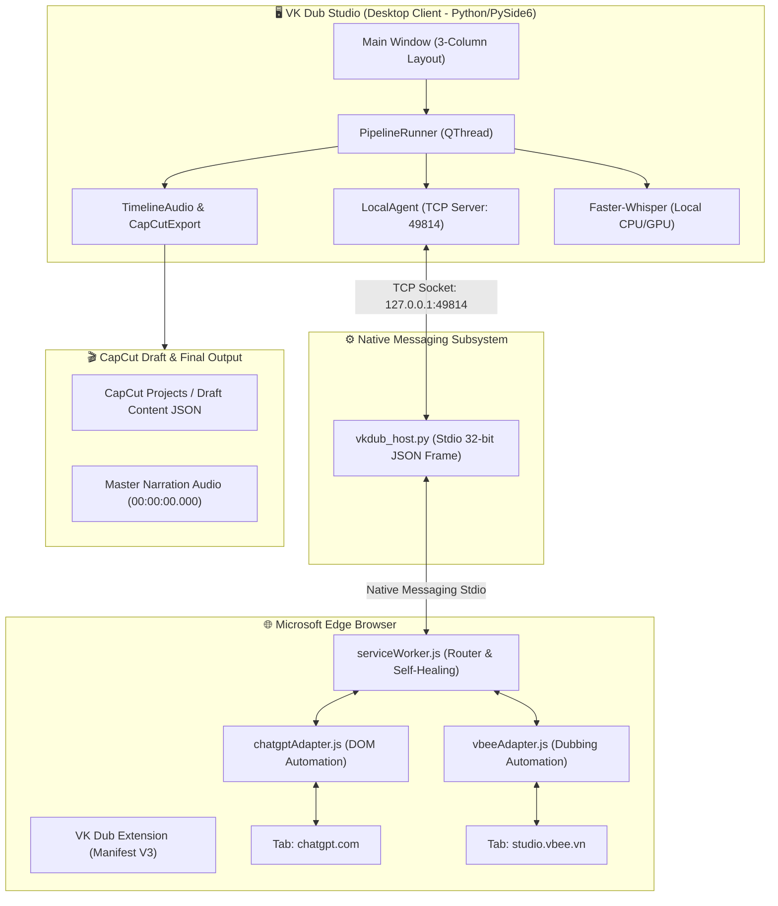

# TÀI LIỆU TOÀN DIỆN DỰ ÁN VK DUB STUDIO (PHIÊN BẢN V2.1.8)

> **VK Dub Studio** là giải pháp phần mềm Desktop chuyên nghiệp (chạy trên nền tảng Windows x64 với PySide6 / Qt) kết hợp **Browser Automation Bridge (Microsoft Edge Extension)** để tự động hóa toàn diện quy trình lồng tiếng (dubbing), dịch ngữ cảnh phụ đề bằng **ChatGPT**, tạo giọng đọc tự nhiên bằng **Vbee Studio**, xóa chữ/làm mờ vùng phụ đề cũ và xuất trực tiếp sang dự án **CapCut Draft**.

---

## MỤC LỤC

1. [Tổng Quan & Giá Trị Cốt Lõi](#1-tổng-quan--giá-trị-cốt-lõi)
2. [Kiến Trúc Hệ Thống (Architecture Blueprint)](#2-kiến-trúc-hệ-thống-architecture-blueprint)
3. [Quy Trình Hoạt Động 5 Bước (5-Step Workflow)](#3-quy-trình-hoạt-động-5-bước-5-step-workflow)
4. [Hệ Thống Cầu Nối Trình Duyệt (Browser Bridge & Extension)](#4-hệ-thống-cầu-nối-trình-duyệt-browser-bridge--extension)
5. [Quy Trình Xử Lý Âm Thanh & Ghép Dòng Thời Gian CapCut](#5-quy-trình-xử-lý-âm-thanh--ghép-dòng-thời-gian-capcut)
6. [Cấu Trúc Thư Mục Chi Tiết](#6-cấu-trúc-thư-mục-chi-tiết)
7. [Danh Mục Module & Lớp Trọng Tâm](#7-danh-mục-module--lớp-trọng-tâm)
8. [Bộ Test Suite & Chất Lượng Phần Mềm](#8-bộ-test-suite--chất-lượng-phần-mềm)
9. [Hướng Dẫn Cài Đặt, Vận Hành & Khởi Chạy](#9-hướng-dẫn-cài-đặt-vận-hành--khởi-chạy)

---

## 1. TỔNG QUAN & GIÁ TRỊ CỐT LÕI

### 1.1 Vấn đề thực tế
Quy trình lồng tiếng video ngoại ngữ (phim ngắn, TikTok, Reel, tiểu phẩm...) thông thường đòi hỏi nhiều bước thủ công rời rạc:
1. Trích xuất âm thanh và bóc băng phụ đề gốc.
2. Dịch phụ đề sang tiếng Việt qua các công cụ dịch thông thường (thiếu ngữ cảnh, lệch timecode, cú pháp lủng củng).
3. Copy từng câu vào Vbee để tạo file audio giọng đọc, ghép từng file wav thủ công.
4. Làm mờ vùng phụ đề chữ gốc trong CapCut hoặc Premiere.
5. Căn chỉnh từng câu thoại khớp với cử động môi và hình ảnh.

### 1.2 Giải pháp của VK Dub Studio
VK Dub Studio giải quyết toàn bộ bài toán trên trong **1 click chuột duy nhất** hoặc kiểm soát từng bước theo ý muốn:
- **Tự động bóc băng**: Sử dụng AI Whisper (`faster-whisper`) ngay trên máy cục bộ, không tốn chi phí API, stream kết quả từng câu theo thời gian thực.
- **Dịch ngữ cảnh bằng ChatGPT qua Edge**: Tận dụng tài khoản ChatGPT có sẵn thông qua Extension chuyên dụng, dịch giữ nguyên định dạng SRT, số thứ tự và mốc thời gian (timecode).
- **Cổng kiểm duyệt kịch bản (Review Gate)**: Cho phép người dùng đọc, chỉnh sửa từng câu thoại dịch và mốc thời gian trước khi chuyển sang bước tốn credit âm thanh.
- **Tạo giọng đọc Vbee tự động**: Tự động tải SRT lên Vbee Studio, chọn giọng đọc (Ngọc Huyền, Mạnh Dũng...), tốc độ (1.1x, 1.2x...), tải audio hoàn chỉnh về máy.
- **Dòng thời gian âm thanh CapCut (Master Timeline)**: Tự động căn khớp dòng thời gian âm thanh bắt đầu chuẩn từ `00:00:00.000`, chèn silence padding chính xác cho từng khoảng lặng và xuất thẳng vào thư mục dự án CapCut Draft.

---

## 2. KIẾN TRÚC HỆ THỐNG (ARCHITECTURE BLUEPRINT)



### Các lớp kiến trúc chính:
1. **Presentation Layer (`src/vkdub/ui/`)**:
   - Giao diện 3 cột hiện đại, tối ưu hóa không gian làm việc:
     - **Cột trái**: Bộ điều khiển quy trình 5 bước (Stepper Sidebar).
     - **Cột giữa**: Khung xem trước video (Video Preview) kèm công cụ vẽ vùng làm mờ (Blur Overlay).
     - **Cột phải**: Khu vực xử lý tự động (Step 4 Automation Panel) và Cổng kiểm duyệt kịch bản (Step 5 Review Panel).
     - **Phía dưới**: Ngăn kéo chẩn đoán & nhật ký hệ thống (Diagnostics Drawer) có thể thu gọn/mở rộng.
2. **Orchestration Layer (`src/vkdub/orchestrator/`)**:
   - `PipelineRunner` kế thừa `QThread`, điều phối toàn bộ chuỗi tác vụ từ 4.1 ➔ 4.4, phát các tín hiệu Qt thread-safe (`progress_updated`, `substep_updated`, `log_emitted`, `state_changed`).
3. **Bridge & Automation Layer (`src/vkdub/bridge/` & `apps/browser-extension/`)**:
   - Giao thức IPC hai chiều không chiếm dụng cổng web: Desktop TCP Socket ➔ Native Messaging Host ➔ Extension Service Worker ➔ Content Script Adapter.
4. **Media Processing Layer (`src/vkdub/media/` & `src/vkdub/services/`)**:
   - `audio_extract.py`: Trích xuất âm thanh từ MP4 bằng FFmpeg.
   - `timeline_audio.py`: Xây dựng dòng thời gian thuyết minh có đệm khoảng lặng chính xác đến từng mili-giây.
   - `capcut_export.py`: Tạo cấu trúc thư mục Draft và sinh file `draft_content.json` theo chuẩn CapCut PC.

---

## 3. QUY TRÌNH HOẠT ĐỘNG 5 BƯỚC (5-STEP WORKFLOW)

```
[01 Source] ➔ [02 Voice] ➔ [03 Blur Regions] ➔ [04 Processing Pipeline] ➔ [05 Review & Export]
                                                        │
         ┌──────────────────────────────────────────────┴────────────────────────────┐
         │                                                                           │
       [4.1] Bóc băng phụ đề gốc (Whisper)                                          │
         │                                                                           │
       [4.2] Dịch ngữ cảnh bằng ChatGPT (Edge Extension)                             │
         │                                                                           │
       [4.3] Chuẩn hóa kịch bản & Cổng duyệt (PAUSE tại Bước 05) ◄───────────────────┘
         │
   [Người dùng duyệt kịch bản tại Bước 05]
         │
       [4.4] Tạo âm thanh Vbee Studio & Dòng thời gian CapCut
```

### Bước 01: Chọn Video Nguồn (Source Video)
- Chọn file MP4 nguồn từ máy tính.
- Hệ thống tự động phân tích độ dài, độ phân giải, tỉ lệ khung hình (FPS) và hiển thị lên player video.

### Bước 02: Thiết Lập Giọng Đọc (Voice Settings)
- Lựa chọn giọng đọc mục tiêu: **HN - Ngọc Huyền**, **HN - Mạnh Dũng**, v.v.
- Thiết lập tốc độ đọc: **1.1x**, **1.2x**, **1.0x**.

### Bước 03: Vẽ Vùng Làm Mờ Phụ Đề Gốc (Blur Regions)
- Người dùng kéo thả trực tiếp trên khung xem video để đánh dấu vùng chứa phụ đề chữ của video gốc (ví dụ phụ đề tiếng Trung/Anh).
- Phần mềm hỗ trợ làm mờ Gaussian Blur hoặc làm mịn để che phụ đề gốc.

### Bước 04: Xử Lý Tự Động (Processing Pipeline)
- **4.1 Bóc băng (Whisper)**: Trích xuất `audio_source.wav`, chạy mô hình `faster-whisper` trên máy cục bộ, truyền phát từng câu nhận diện được vào file `original.srt`.
- **4.2 Dịch ngữ cảnh (ChatGPT qua Edge)**: Gửi phụ đề gốc sang tab ChatGPT trên Microsoft Edge, điền prompt, tự động ấn gửi, theo dõi tiến trình và nhận phụ đề dịch đã chuẩn hóa timecode.
- **4.3 Chốt kịch bản & Chuyển bước**: Kiểm tra tính toàn vẹn của file SRT dịch (`validate_and_repair_srt`), nạp vào dự án và **tự động tạm dừng chuyển sang Bước 05** để người dùng xem lại.
- **4.4 Tạo Voice Vbee**: Khi kịch bản đã được xác nhận duyệt, tải file phụ đề lên Vbee Studio, tải master audio về máy, căn khớp timeline từ `00:00:00.000` và xuất dự án CapCut.

### Bước 05: Kiểm Duyệt Kịch Bản & Xuất Bản (Review & Export)
- Hiển thị bảng danh sách toàn bộ câu thoại (mốc bắt đầu, mốc kết thúc, nội dung gốc, nội dung dịch tiếng Việt).
- Người dùng có thể chỉnh sửa câu từ trực tiếp, sửa timecode, nghe thử từng câu hoặc xuất file CapCut Draft hoàn thiện.

---

## 4. HỆ THỐNG CẦU NỐI TRÌNH DUYỆT (BROWSER BRIDGE & EXTENSION)

### 4.1 Cơ chế hoạt động
Không dùng Selenium hay Puppeteer nặng nề dễ bị các trang web chặn Cloudflare/Bot-detection, VK Dub Studio sử dụng **Edge Extension tự nhiên (Manifest V3)**:
- Người dùng đăng nhập ChatGPT (`chatgpt.com`) và Vbee (`studio.vbee.vn`) bình thường trên Edge như lướt web hàng ngày.
- Extension lắng nghe lệnh từ ứng dụng Desktop thông qua **Native Messaging Host**.
- Tận dụng phiên đăng nhập (Cookies/Session) thật 100% của người dùng, không bị hỏi Captcha hay giới hạn bất thường.

### 4.2 Giao thức kết nối (Protocol)
- **Cổng TCP cục bộ**: `127.0.0.1:49814`
- **Native Host Registry**:
  - Windows Registry Key: `HKCU\Software\Microsoft\Edge\NativeMessagingHosts\com.vkdub.bridge`
  - Trỏ vào file manifest: `tools/native_host/com.vkdub.bridge.json`
- **Các Action trong giao thức**:
  - `GET_STATUS` / `STATUS_REPORT`: Báo cáo trạng thái kết nối Edge, tab ChatGPT, tab Vbee, cookie đăng nhập.
  - `CHATGPT_TRANSLATE` / `CHATGPT_TRANSLATE_RESULT`: Gửi nội dung SRT và nhận bản dịch.
  - `VBEE_GENERATE_VOICE` / `VBEE_VOICE_RESULT`: Gửi kịch bản tạo giọng và nhận file âm thanh hoàn tất.
  - `LOG_EVENT`: Truyền phát log thời gian thực từ content script về giao diện phần mềm.
  - `RELOAD_EXTENSION`: Yêu cầu Service Worker tự động nạp lại mã mới mà không cần thao tác thủ công.

### 4.3 Công nghệ nạp Script tự phục hồi (Self-Healing Dynamic Injection)
- Không phụ thuộc vào việc tab đã có sẵn content script từ trước hay chưa.
- Khi nhận lệnh dịch/tạo voice, `serviceWorker.js` chủ động dùng API `chrome.scripting.executeScript` để bơm adapter vào trang đích theo thời gian thực.
- Nếu tab bị mất kết nối hoặc reload, Service Worker tự động thử lại an toàn, loại bỏ hoàn toàn các lỗi ngắt quãng hay lỗi không khớp phiên bản.

---

## 5. QUY TRÌNH XỬ LÝ ÂM THANH & GHÉP DÒNG THỜI GIAN CAPCUT

### 5.1 Chuẩn hóa Dòng Thời Gian (Timeline Sync Rule)
- Trong sản xuất video, âm thanh thuyết minh nếu bị dịch chuyển (offset) hoặc khuyết phần đầu video sẽ làm toàn bộ phụ đề và giọng đọc phía sau bị lệch khẩu hình.
- **Quy tắc tuyệt đối của VK Dub Studio**:
  - Master Narration Timeline **luôn bắt đầu chính xác từ mốc `00:00:00.000`**.
  - Nếu câu thoại đầu tiên bắt đầu ở giây thứ `00:00:02.500`, hệ thống sẽ tự động chèn **2.5 giây khoảng lặng (silence padding)** vào đầu file âm thanh.
  - Các khoảng trống giữa các câu thoại cũng được chèn silence padding theo đúng timecode của file SRT.

### 5.2 Tích hợp CapCut Draft
- Cấu trúc thư mục CapCut Draft được tạo tự động:
  ```
  %LOCALAPPDATA%\CapCut\User Data\Projects\com.lveditor.draft\[Draft_ID]\
  ├── draft_content.json
  ├── draft_meta_info.json
  └── Assets\
      ├── original_video.mp4
      ├── master_narration.wav
      └── translated_subtitles.srt
  ```
- File `draft_content.json` chứa đầy đủ track video, track audio thuyết minh và track phụ đề văn bản tiếng Việt. Khi người dùng mở ứng dụng CapCut PC, dự án đã sẵn sàng ở đầu danh sách để chỉnh sửa hoặc xuất video ngay lập tức.

---

## 6. CẤU TRÚC THƯ MỤC CHI TIẾT

```
d:\ToolVideo\
├── app.py                          # File thực thi khởi động ứng dụng Desktop
├── pyproject.toml                  # Khai báo cấu hình dự án, dependencies và build system
├── uv.lock                         # Lockfile quản lý package của uv
├── Chạy_VK_Dub_Studio.bat          # Script click-to-run dành cho người dùng cuối
├── run_app.bat                     # Script khởi chạy môi trường dev
├── .env.example                    # File mẫu biến môi trường (nếu cần dùng Cloud API)
│
├── apps/
│   └── browser-extension/          # Toàn bộ mã nguồn Microsoft Edge Extension (Manifest V3)
│       ├── manifest.json           # Khai báo quyền hạn (permissions, host_permissions, content_scripts)
│       ├── background/
│       │   └── serviceWorker.js    # Service worker xử lý định tuyến & Self-Healing Injection
│       ├── content/
│       │   ├── chatgptAdapter.js   # Tự động hóa ChatGPT (nhập prompt, bắt streaming, trích xuất SRT)
│       │   └── vbeeAdapter.js      # Tự động hóa Vbee Studio (upload SRT, chọn giọng, tải master audio)
│       ├── bridge/
│       │   ├── nativeMessaging.js  # Thư viện giao tiếp Native Messaging trong browser
│       │   └── protocol.js         # Định nghĩa các hằng số, Action và Status flags
│       └── icons/
│           └── icon48.png          # Biểu tượng của tiện ích mở rộng
│
├── src/
│   └── vkdub/                      # Gói mã nguồn chính của ứng dụng VK Dub Studio
│       ├── domain/                 # Các thực thể nghiệp vụ cốt lõi (Domain Models)
│       │   ├── project.py          # Đối tượng Project, lưu trữ toàn bộ trạng thái phiên làm việc
│       │   ├── script.py           # Quản lý kịch bản, câu thoại ScriptLine, Timecode
│       │   ├── settings.py         # Cấu hình người dùng, giọng đọc, mô hình Whisper
│       │   └── timeline.py         # Dữ liệu dòng thời gian âm thanh và phụ đề
│       │
│       ├── orchestrator/           # Điều phối luồng xử lý tự động
│       │   └── pipeline_runner.py  # QThread chạy tuần tự 4.1 ➔ 4.4, xử lý review gate Bước 5
│       │
│       ├── bridge/                 # Giao tiếp Desktop ➔ Browser
│       │   ├── local_agent.py      # TCP Server tiếp nhận dữ liệu từ Native Messaging Host
│       │   ├── protocol.py         # Định nghĩa cấu trúc thông điệp phía Python
│       │   └── registry.py         # Tự động cấu hình Registry Windows cho Edge Native Host
│       │
│       ├── media/                  # Xử lý video, audio và phụ đề
│       │   ├── audio_extract.py    # Tách audio nguồn từ file video bằng FFmpeg
│       │   ├── timeline_audio.py   # Ghép master audio với silence padding từ 00:00:00.000
│       │   ├── srt_parser.py       # Phân tích cú pháp file SRT thành đối tượng dữ liệu
│       │   └── process.py          # Quản lý tiến trình xử lý media đa luồng
│       │
│       ├── services/               # Dịch vụ phụ trợ & Xuất bản
│       │   ├── capcut_export.py    # Tạo cấu trúc CapCut Draft hoàn chỉnh
│       │   ├── srt_validator.py    # Kiểm tra tính toàn vẹn, khớp câu và tự sửa lỗi timecode SRT
│       │   ├── project_service.py  # Lưu/Mở file dự án `.vkproj`
│       │   └── health_service.py   # Kiểm tra sức khỏe môi trường (FFmpeg, Edge, RAM...)
│       │
│       └── ui/                     # Giao diện người dùng đồ họa (PySide6)
│           ├── main_window.py      # Cửa sổ chính, tích hợp 3 cột và menu điều khiển
│           ├── top_bar.py          # Thanh công cụ trên cùng: Trạng thái Edge, ChatGPT, Vbee
│           ├── stepper_sidebar.py  # Cột trái: Điều hướng 5 bước quy trình
│           ├── video_preview.py    # Cột giữa: Trình phát video & lớp phủ vẽ vùng mờ
│           ├── pipeline_step4_widget.py # Cột phải: Bảng điều khiển tiến trình 4.1 - 4.4
│           ├── script_review_panel.py   # Cột phải: Bảng kiểm duyệt, sửa kịch bản Bước 05
│           ├── diagnostics_drawer.py    # Ngăn kéo dưới cùng: Logs & Chẩn đoán trực tiếp
│           └── review_controller.py     # Điều khiển trạng thái phê duyệt kịch bản
│
├── tools/                          # Công cụ phụ trợ & Native Host
│   ├── native_host/
│   │   ├── com.vkdub.bridge.json   # Manifest Native Messaging Host cho Windows
│   │   ├── vkdub_host.bat          # Wrapper script khởi động native host python
│   │   └── vkdub_host.py           # Native Messaging Host kết nối Stdio ➔ TCP Socket
│   └── register_edge_manifest.bat  # Script tự động đăng ký manifest vào Windows Registry
│
└── tests/                          # Bộ kiểm thử tự động toàn diện (PyTest)
    ├── test_local_agent.py         # Kiểm thử giao tiếp LocalAgent & Native Bridge
    ├── test_pipeline_runner.py     # Kiểm thử luồng chạy Pipeline từ 4.1 ➔ 4.4
    ├── test_bridge_protocol.py     # Kiểm thử chuẩn hóa payload tin nhắn
    ├── test_srt_validator.py       # Kiểm thử thuật toán sửa lỗi timecode phụ đề
    ├── test_timeline_audio.py      # Kiểm thử đệm khoảng lặng âm thanh từ 00:00:00.000
    ├── test_ui_restructure.py      # Kiểm thử layout 3 cột và ngăn kéo log
    └── test_capcut_export.py       # Kiểm thử cấu trúc file xuất CapCut Draft
```

---

## 7. DANH MỤC MODULE & LỚP TRỌNG TÂM

| Module / Lớp | File nguồn | Chức năng chính |
| :--- | :--- | :--- |
| **`MainWindow`** | `src/vkdub/ui/main_window.py` | Cửa sổ ứng dụng chính, quản lý kết nối giữa UI, LocalAgent và PipelineRunner. |
| **`PipelineRunner`** | `src/vkdub/orchestrator/pipeline_runner.py` | Luồng chạy tự động các bước 4.1 ➔ 4.4, kích hoạt cổng dừng Bước 05. |
| **`LocalAgent`** | `src/vkdub/bridge/local_agent.py` | Quản lý máy chủ socket cục bộ `127.0.0.1:49814`, điều khiển phiên dịch và sinh voice. |
| **`TimelineAudio`** | `src/vkdub/media/timeline_audio.py` | Tạo master narration audio bắt đầu chuẩn từ `00:00:00.000` với silence padding. |
| **`CapCutExporter`** | `src/vkdub/services/capcut_export.py` | Tạo cấu trúc CapCut Draft hợp lệ, sinh `draft_content.json`. |
| **`SrtValidator`** | `src/vkdub/services/srt_validator.py` | Đối soát số lượng câu thoại và tự động sửa lệch timecode phụ đề. |
| **`chatgptAdapter`** | `apps/browser-extension/content/chatgptAdapter.js` | Tự động hóa điền prompt ChatGPT, bắt streaming và trích xuất code block SRT. |
| **`vbeeAdapter`** | `apps/browser-extension/content/vbeeAdapter.js` | Tự động hóa tải file SRT lên Vbee Studio, chọn giọng/tốc độ và tải audio. |
| **`ServiceWorker`** | `apps/browser-extension/background/serviceWorker.js` | Định tuyến tin nhắn Native Messaging, kiểm tra cookie và tự phục hồi nạp script. |

---

## 8. BỘ TEST SUITE & CHẤT LƯỢNG PHẦN MỀM

Dự án sở hữu bộ kiểm thử tự động toàn diện được viết bằng `pytest` và `pytest-qt`:

```bash
cmd /c "set PYTHONPATH=src && .venv\Scripts\python.exe -m pytest tests/test_local_agent.py tests/test_pipeline_runner.py tests/test_bridge_protocol.py tests/test_srt_validator.py tests/test_timeline_audio.py tests/test_ui_restructure.py tests/test_capcut_export.py"
```

### Kết quả kiểm thử:
- **38/38 kiểm thử đơn vị & tích hợp đạt 100% (PASS)**
- Kiểm tra tính hợp lệ của Native Messaging framed JSON (32-bit little-endian).
- Kiểm tra cơ chế tự động sửa lỗi lệch timecode khi ChatGPT vô tình làm xê dịch vài mili-giây.
- Kiểm tra tính nguyên vẹn của dòng thời gian âm thanh bắt đầu từ mốc 0 giây.
- Kiểm tra chuyển đổi mượt mà giữa các bước trên giao diện người dùng.

---

## 9. HƯỚNG DẪN CÀI ĐẶT, VẬN HÀNH & KHỞI CHẠY

### 9.1 Yêu cầu hệ thống
- Hệ điều hành: **Windows 10 / Windows 11 (64-bit)**.
- Trình duyệt: **Microsoft Edge** (đã cài sẵn trên Windows).
- Python: **Phiên bản 3.10, 3.11 hoặc 3.12**.
- Công cụ quản lý gói khuyên dùng: **`uv`** (hoặc `pip` / `virtualenv`).
- Bộ giải mã đa phương tiện: **`ffmpeg.exe`** và **`ffprobe.exe`** (đặt trong thư mục `tools/` hoặc có sẵn trong Windows PATH).

### 9.2 Các bước khởi động nhanh
1. **Tạo môi trường ảo và cài đặt thư viện**:
   ```bash
   uv sync
   # Hoặc dùng pip truyền thống:
   python -m venv .venv
   .venv\Scripts\activate
   pip install -e .
   ```

2. **Cài đặt Extension vào Microsoft Edge**:
   - Mở Microsoft Edge, truy cập đường dẫn: `edge://extensions/`.
   - Bật công tắc **"Chế độ dành cho nhà phát triển" (Developer mode)** ở góc dưới bên trái.
   - Nhấn nút **"Tải phần mở rộng đã giải nén" (Load unpacked)**.
   - Chọn thư mục: `d:\ToolVideo\apps\browser-extension`.

3. **Đăng ký Native Messaging Host**:
   - Chạy file: `tools\register_edge_manifest.bat` (nhấp đúp chuột để tự động thêm Registry Key).

4. **Khởi chạy ứng dụng**:
   - Nhấp đúp vào file **`Chạy_VK_Dub_Studio.bat`** trên màn hình để sử dụng.
