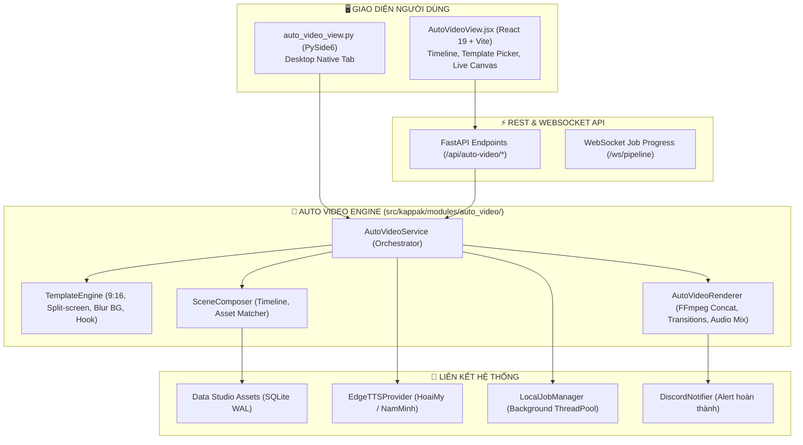

# 🎬 Auto Video Generator — Kế Hoạch Triển Khai Chi Tiết (Implementation Plan)

**Mã kế hoạch:** `auto-video-generator`  
**Phiên bản mục tiêu:** `v2.2.0`  
**Trạng thái:** DRAFT → REVIEW  
**Module:** `src/kappak/modules/auto_video/` & `frontend/src/components/auto_video/`  
**Mục tiêu cốt lõi:** Tự động hóa quy trình sản xuất video ngắn dạng dọc 9:16 (Shorts/Reels/TikTok) từ kịch bản văn bản và kho tài nguyên (assets) có sẵn trong Data Studio, tích hợp lồng tiếng AI (Edge-TTS) và phụ đề động.

---

## I. KIẾN TRÚC & PHÂN CHIA RANH GIỚI (SYSTEM BOUNDARIES)

### Ranh giới trách nhiệm (Boundaries):
1. **Frontend (`AutoVideoView.jsx`)**: Quản lý state 3 bước (1. Nhập kịch bản/chọn mẫu → 2. Ghép cảnh & chọn tư liệu → 3. Tinh chỉnh & Render), hiển thị preview khung hình dọc 9:16 tỷ lệ chuẩn điện thoại.
2. **Core Service (`service.py`)**: Điều phối luồng, kiểm tra tính hợp lệ dữ liệu, gọi TTS sinh voiceover cho từng cảnh, tính toán timecode khớp thời lượng video.
3. **Template Engine (`templates.py`)**: Quản lý các preset bố cục 9:16:
   - *Preset 1 — Cinematic Vertical*: Video gốc ở giữa, làm mờ nền 2 dải trên/dưới (blurred background mirror).
   - *Preset 2 — Split Screen*: Nửa trên hiển thị video tư liệu, nửa dưới hiển thị reaction/b-roll hoặc quote chữ nổi bật.
   - *Preset 3 — Storytelling with Hook*: Tiêu đề hook cố định ở đỉnh, video ở giữa, phụ đề karaoke/word-by-word ở đáy.
4. **Renderer (`renderer.py`)**: Xây dựng filtergraph FFmpeg tối ưu, áp dụng hardware acceleration (NVENC/QSV/CPU) đã có sẵn trong `src/vkdub/media/hardware.py`.
5. **Database**: Bổ sung bảng `auto_video_projects` vào `src/kappak/core/db.py` liên kết khóa ngoại với `projects` và `assets`.

---

## II. DANH SÁCH FILE THỰC THI (FILE MANIFEST)

| Thao tác | Đường dẫn file | Vai trò / Trách nhiệm |
|:---|:---|:---|
| **NEW** | `src/kappak/modules/auto_video/__init__.py` | Package entrypoint & export |
| **NEW** | `src/kappak/modules/auto_video/domain.py` | Dataclass models (`Scene`, `AutoVideoProject`, `TemplateConfig`) |
| **NEW** | `src/kappak/modules/auto_video/templates.py` | 3 Layout templates dọc 9:16 & FFmpeg filter generators |
| **NEW** | `src/kappak/modules/auto_video/service.py` | Logic nghiệp vụ cắt cảnh, khớp voiceover, quản lý dự án |
| **NEW** | `src/kappak/modules/auto_video/renderer.py` | FFmpeg rendering pipeline (concat, subtitles, BGM mixing) |
| **MODIFY** | `src/kappak/core/db.py` | Thêm bảng `auto_video_projects` vào schema SQLite |
| **MODIFY** | `src/vkdub/web/server.py` | Thêm 5 REST endpoints `/api/auto-video/*` |
| **NEW** | `frontend/src/components/auto_video/AutoVideoView.jsx` | Giao diện React 19 Apple Glass cho Auto Video |
| **MODIFY** | `frontend/src/App.jsx` | Gắn `AutoVideoView` vào tab `auto-video` (thay thế placeholder) |
| **MODIFY** | `src/kappak/ui/modules/auto_video_view.py` | Cập nhật giao diện Desktop PySide6 |
| **NEW** | `tests/kappak/test_auto_video.py` | Bộ kiểm thử tự động toàn diện cho Auto Video |

---

## III. BẢNG PHÂN CÔNG AI AGENT (AGENT ASSIGNMENTS)

| Pha / Nhiệm vụ | Chuyên gia phụ trách | Kỹ năng yêu cầu (Skills) |
|:---|:---|:---|
| **Pha 1: Core Domain & DB Schema** | `database-architect` + `backend-specialist` | `database-design`, `clean-code` |
| **Pha 2: Template & FFmpeg Renderer** | `backend-specialist` | `python-patterns`, `toolvideo-dev` |
| **Pha 3: Web REST Endpoints & Job Queue** | `backend-specialist` | `api-patterns`, `clean-code` |
| **Pha 4: React 19 Frontend Web UI** | `frontend-specialist` | `frontend-design`, `kappak-ui-design` |
| **Pha 5: Desktop PySide6 View** | `backend-specialist` | `clean-code`, `powershell-windows` |
| **Pha 6: Testing & Verification** | `test-engineer` | `testing-patterns`, `verify-changes` |

---

## IV. KẾ HOẠCH HÀNH ĐỘNG TỪNG BƯỚC (SPRINT BREAKDOWN)

### 🔹 Sprint 1: Nền tảng Backend & Schema CSDL
- [ ] **Task 1.1**: Định nghĩa domain models trong `src/kappak/modules/auto_video/domain.py`:
  - `SceneSegment`: start_sec, end_sec, text, voice_path, asset_id, transition
  - `AutoVideoConfig`: aspect_ratio ("9:16"), template_id, target_duration, bgm_asset_id, subtitle_style
  - `AutoVideoProject`: id, name, status, scenes (JSON), output_path
- [ ] **Task 1.2**: Mở rộng schema trong `src/kappak/core/db.py`: Tạo bảng `auto_video_projects` với chỉ mục an toàn.
- [ ] **Task 1.3**: Xây dựng `templates.py`: Tạo FFmpeg filtergraph strings cho 3 mẫu bố cục 9:16:
  - Blur Background 9:16 (scale center + split crop blur)
  - Split Screen 9:16 (top/bottom pad)
  - Classic Caption Header (drawbox + text overlay)

### 🔹 Sprint 2: Audio Sync & FFmpeg Render Engine
- [ ] **Task 2.1**: Kết nối `EdgeTTSProvider` vào `service.py`: Tự động sinh giọng đọc cho từng câu kịch bản và lấy timecode chính xác qua `ffprobe`.
- [ ] **Task 2.2**: Xây dựng `renderer.py`:
  - Cắt các đoạn clip tương ứng từ assets nguồn
  - Ghép video (concat demuxer hoặc filter_complex)
  - Hòa âm: Giọng đọc chính (volume 100%) + BGM nhẹ nền (volume 12-15%, ducking tự động)
  - Nướng phụ đề (Burn subtitle ASS style TikTok nổi bật, viền đen chữ vàng/trắng)
- [ ] **Task 2.3**: Tích hợp với `LocalJobManager`: Đẩy tiến trình render ra worker ngầm, cập nhật % tiến độ thời gian thực.

### 🔹 Sprint 3: API & Web Studio UI
- [ ] **Task 3.1**: Thêm REST endpoints vào `src/vkdub/web/server.py`:
  - `GET /api/auto-video/templates` — Trả về danh sách mẫu bố cục kèm ảnh mô phỏng
  - `POST /api/auto-video/script/parse` — Phân tích văn bản kịch bản thành danh sách câu/cảnh
  - `POST /api/auto-video/projects` — Tạo và lưu dự án Auto Video
  - `POST /api/auto-video/projects/{id}/render` — Bắt đầu tác vụ render
  - `GET /api/auto-video/projects/{id}/status` — Lấy tiến độ job
- [ ] **Task 3.2**: Xây dựng `AutoVideoView.jsx` trong `frontend/src/components/auto_video/`:
  - Bố cục Apple Glass (Sidebar cấu hình + Khung xem trước 9:16 Phone Frame + Timeline cảnh)
  - Bộ chọn mẫu (Template Cards có badge)
  - Trình soạn thảo kịch bản trực quan, tự động tính ước lượng thời lượng video
  - Nút "🚀 Bắt đầu tạo Video" kèm hiệu ứng Dynamic Island
- [ ] **Task 3.3**: Cập nhật tab `auto-video` trong `frontend/src/App.jsx` để nạp component thật thay vì màn hình chờ.

### 🔹 Sprint 4: Desktop PySide6 UI & Tích hợp Hoàn thiện
- [ ] **Task 4.1**: Nâng cấp `src/kappak/ui/modules/auto_video_view.py`: Bổ sung form cấu hình, nút chọn tư liệu từ Data Studio và thanh tiến trình.
- [ ] **Task 4.2**: Kết nối thông báo Discord qua `discord_notifier.py`: Gửi rich embed thông báo ngay khi video 9:16 được render hoàn tất.

---

## V. CHECKLIST KIỂM THỬ & CHỨNG THỰC (PHASE X: VERIFICATION)

> [!IMPORTANT]
> **Tuân thủ quy tắc Anti-False Reporting (AGENTS.md §2.1)**:  
> Tính năng chỉ được tuyên bố hoàn thành khi vượt qua toàn bộ các bài test dưới đây:

- [ ] **Unit Tests (`tests/kappak/test_auto_video.py`)**:
  - `test_domain_serialization`: Serialization/Deserialization JSON của Scene và Config.
  - `test_db_migration_auto_video`: Kiểm tra khởi tạo và truy vấn bảng `auto_video_projects`.
  - `test_template_filter_generation`: Kiểm tra cú pháp filtergraph FFmpeg sinh ra cho 3 mẫu 9:16.
  - `test_script_parsing`: Kiểm tra bóc tách đoạn văn bản thành các câu thoại có ước lượng độ dài.
- [ ] **Integration Tests**:
  - `test_auto_video_api_endpoints`: TestClient FastAPI gọi thử chuỗi API: tạo dự án → parse script → query templates.
  - `test_e2e_mock_render`: Chạy thử nghiệm quy trình ghép video từ tư liệu mẫu và kiểm tra file đầu ra tồn tại, kích thước > 0.
- [ ] **Frontend Build Verification**:
  - `cd frontend && npm run build` thành công, không có lỗi linter/type.
- [ ] **Code Quality Gates**:
  - `ruff check .` đạt 0 cảnh báo.
  - `mypy` strict type-checking PASS.
- [ ] **Discord Webhook**:
  - Xác nhận gửi thành công thông báo rich embed render hoàn tất vào kênh Discord.
