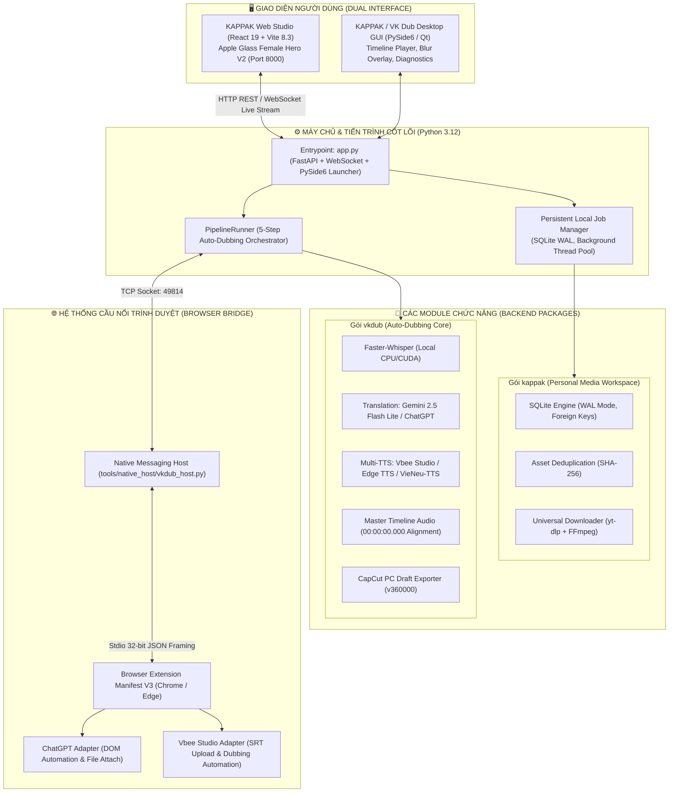

# TỔNG QUAN TOÀN DIỆN DỰ ÁN VK DUB STUDIO & KAPPAK PERSONAL MEDIA STUDIO

> **Tác giả / Duy trì**: Khúc Việt Anh (`vanhkhuc.dev`)  
> **Phiên bản hiện tại**: KAPPAK Studio Desktop v2.1-downloader / Web Studio v2 / VK Dub Studio 2.0 (0.4.0)  
> **Nền tảng mục tiêu**: Windows 11 x64 | Python 3.12 (`.venv`) | Node.js (React 19 + Vite 8.3)  
> **Repository**: `TOOLVIDEO` (`vanhkhuc-k5/vk-dub-studio`)

---

## 1. GIỚI THIỆU & TRIẾT LÝ THIẾT KẾ

### 1.1 Mục Tiêu Của Dự Án
**VK Dub Studio & KAPPAK Personal Media Studio** là một hệ sinh thái phần mềm sáng tạo nội dung và tự động hóa biên tập video chuyên sâu dành cho nhà sáng tạo nội dung (Content Creator, Solo Media Producer, Editor). Dự án giải quyết các vấn đề nặng nhọc và rời rạc nhất trong sản xuất video:
1. **Auto-Dubbing (Lồng tiếng đa ngôn ngữ)**: Tự động tải video, bóc băng giọng nói (Speech-to-Text), dịch phụ đề giữ nguyên ngữ cảnh và nhịp điệu (Contextual Translation), tạo giọng đọc AI tự nhiên (AI Voice Synthesis), làm mờ vùng phụ đề gốc (Subtitle Masking) và xuất trực tiếp ra **CapCut PC Draft Project** hoặc tệp MP4 hoàn chỉnh.
2. **Personal Media Workspace (KAPPAK Studio)**: Không gian quản lý dự án video cục bộ (Local-First), tải video đa nền tảng (TikTok, YouTube, Douyin, Facebook, Instagram) chất lượng cao không watermark, quản lý kho tư liệu với cơ chế chống trùng lặp (SHA-256 Deduplication) và hàng đợi tác vụ chạy nền (Persistent Job Manager).

### 1.2 Triết Lý Cốt Lõi (Core Principles)
- **Local-First & Không lệ thuộc Cloud đắt đỏ**: Ưu tiên xử lý trên phần cứng máy tính người dùng (Whisper AI offline, Edge TTS offline, SQLite WAL database cục bộ).
- **Hybrid Browser Automation**: Thay vì phải trả chi phí API hàng tháng đắt đỏ, hệ thống tích hợp **Browser Extension Bridge (Manifest V3)** để tự động hóa trực tiếp trên các dịch vụ có sẵn của người dùng như ChatGPT Web và Vbee Studio.
- **Apple Glass Minimalist Aesthetic**: Ngôn ngữ thiết kế tối giản, cao cấp, thanh lịch (Glassmorphism, Icon Rail 74px, Topbar với Search Pill lớn, bảng màu pastel dịu mắt, hiệu ứng vi tương tác mượt mà).
- **Anti-False Reporting (Chống báo cáo khống)**: Mọi chức năng mới hoặc sửa đổi đều phải được kiểm chứng bằng test pass thực tế (`pytest`, `npm run build`), log thực tế, tuyệt đối không tuyên bố hoàn thành chỉ vì có giao diện mẫu.
- **Bảo mật tuyệt đối (Zero Leaks)**: API Keys được lưu trữ bằng Windows Credential Manager (`keyring`), không ghi log, console hay commit chứa secret.

---

## 2. KIẾN TRÚC HỆ THỐNG TỔNG THỂ (SYSTEM ARCHITECTURE)

Hệ thống được thiết kế theo mô hình **Dual Interface & Dual Backend Engine**:



---

## 3. CÁC MODULE VÀ TÍNH NĂNG CHÍNH

### 3.1 Quy Trình Lồng Tiếng 5 Bước (Auto-Dubbing Pipeline)

Quy trình tự động hóa độc quyền của **VK Dub Studio** xử lý video ngoại ngữ (Trung, Anh, Nhật, Hàn...) thành video lồng tiếng Việt chuẩn mực:

| Bước | Tên bước | Công nghệ & Chi tiết thực hiện |
|---|---|---|
| **Bước 1: Nguồn video** | Import & Trích xuất âm thanh | Hỗ trợ video MP4, MKV, MOV (bao gồm tên Unicode, tiếng Việt có dấu). Trích xuất audio gốc 16kHz mono WAV siêu tốc qua FFmpeg. Đọc metadata chuẩn bằng `ffprobe`. |
| **Bước 2: Bóc băng AI** | Speech-to-Text (`faster-whisper`) | Chạy hoàn toàn offline trên CPU hoặc GPU CUDA. Hỗ trợ các kích thước model: *tiny, base, small, medium, large-v3*. Tự động nhận diện ngôn ngữ hoặc chỉ định. Stream phụ đề gốc có timecode chính xác theo thời gian thực. |
| **Bước 3: Dịch thuật ngữ cảnh** | Contextual AI Translation | **Lựa chọn 1**: Dùng API Google Gemini (`gemini-2.5-flash-lite`) với cơ chế batching tối ưu hóa chi phí.<br/>**Lựa chọn 2**: Tự động hóa qua tab ChatGPT (Microsoft Edge) bằng Extension, gửi nguyên tệp SRT đính kèm, giữ 100% timecode, cấu trúc số thứ tự và ngữ điệu tự nhiên. |
| **Bước 4: Tạo giọng đọc AI** | Multi-Engine Text-to-Speech | Hỗ trợ 3 động cơ lồng tiếng linh hoạt:<br/>1. **Vbee Studio**: Tự động gửi SRT lên Vbee qua Extension, chọn giọng (HN Ngọc Huyền, SG Mạnh Dũng...), chỉnh tốc độ (1.1x - 1.2x), tải về tệp âm thanh WAV/MP3 nguyên khối.<br/>2. **Edge TTS**: Giọng đọc Microsoft Edge Neural cực mượt (Hoài My, Nam Minh), chạy bất đồng bộ hoàn toàn miễn phí không cần API key.<br/>3. **VieNeu-TTS**: Mô hình TTS tiếng Việt chuyên sâu chạy offline. |
| **Bước 5: Kịch bản & Xuất bản** | Review Gate & CapCut Export | Cổng kiểm duyệt kịch bản (Review Gate) cho phép người dùng xem trước, chỉnh sửa từng câu thoại, nghe thử từng đoạn trước khi xuất bản. Xây dựng **Master Timeline Audio** (bắt đầu chuẩn từ `00:00:00.000` với đệm khoảng lặng silence padding chính xác từng mili-giây). Xuất trực tiếp thư mục dự án **CapCut PC Draft** hoặc render tệp MP4 có làm mờ phụ đề cũ (Blur Mask). |

---

### 3.2 Universal Video Downloader (Mô-đun KAPPAK Downloader)
- **Đa nền tảng**: Tải video chất lượng gốc không logo/watermark từ YouTube, TikTok, Douyin, Facebook Reels, Instagram Reels.
- **Trích xuất thông minh**: Lấy thông tin tiêu đề, ảnh thumbnail, tác giả, thời lượng và định dạng trước khi tải.
- **Tích hợp kho Asset**: Tự động tính hash SHA-256, lưu vào thư mục dự án phân cấp của KAPPAK Studio, chống tải trùng lặp gây lãng phí dung lượng.

---

### 3.3 Hệ Thống Cầu Nối Browser Bridge (Microsoft Edge & Chrome)
- **Kiến trúc Native Messaging Host**: Giao tiếp 2 chiều giữa Desktop và Trình duyệt qua Stdio với khung dữ liệu JSON 32-bit (Native Messaging API của Chromium).
- **Cơ chế chống mất kết nối (Self-Healing)**: Service Worker tự động ping-pong, tự kết nối lại nếu bị browser ngắt sau thời gian idle.
- **Extension Side Panel**: Giao diện phụ trợ nằm bên cạnh trình duyệt, cho phép theo dõi trạng thái kết nối, trạng thái đăng nhập ChatGPT / Vbee và kích hoạt tác vụ nhanh.

---

### 3.4 Giao Diện Apple Glass Female Hero V2 (Web & Desktop)
- **Web Studio (Port 8000)**:
  - **Left Icon Rail (74px)**: Thanh điều hướng hẹp phong cách Apple, nút đóng mở cửa sổ macOS, 7 biểu tượng chức năng (Home, Downloader, Data Studio, Auto Video, Auto Dub, Social, Settings).
  - **Topbar (72px)**: Ô tìm kiếm dạng Search Pill mở rộng (580px, phím tắt `Ctrl + K`), chỉ báo `• AI Sẵn sàng`, nút bấm gradient `✦ Ask KAPPAK`, chuông thông báo và avatar người dùng.
  - **Hero Section**: Thiết kế độc quyền với hình ảnh nữ sáng tạo nội dung ngồi làm việc bên laptop, tiêu đề gradient cyan-blue, câu quote cảm hứng và chữ ký trang trí.
  - **Dải 6 Module Card**: 6 thẻ chức năng màu pastel dịu mát (Downloader - Xanh dương, Data Studio - Xanh bạc hà, Auto Video - Tím, Auto Dub - Cyan, Social - Hồng phấn, Hôm nay - Hổ phách).
  - **3 Khối Đáy Cân Đối**: Dự án gần đây (thẻ video có thumbnail thời lượng), Tiếp tục công việc (Empty state chuẩn và nút tạo dự án mới), Gợi ý AI (Lời khuyên kịch bản thông minh).
  - **Ask KAPPAK Drawer (410px)**: Bảng trợ lý thông minh trượt từ cạnh phải với hiệu ứng kính mờ (Backdrop blur 26px), gợi ý câu hỏi nhanh (Quick Chips) và khung hội thoại tương tác trực tiếp.

---

## 4. CẤU TRÚC THƯ MỤC DỰ ÁN (PROJECT REPO LAYOUT)

Cấu trúc repository đã được chuẩn hóa theo tiêu chuẩn Python Project chuyên nghiệp:

```text
TOOLVIDEO/
├── .agent/skills/                      # Cheatsheet/Skill Antigravity IDE (kappak-ui-design, agy-customizations)
├── .agents/skills/                     # Cheatsheet/Skill cấp Workspace (toolvideo-dev)
├── apps/
│   └── browser-extension/              # Chrome/Edge Extension Manifest V3 (Sidepanel, ServiceWorker, Adapters)
├── archive/
│   └── releases/                       # Lưu trữ các gói cài đặt (.zip), chẩn đoán và backup cũ
├── docs/
│   ├── design_specs/                   # Bản vẽ thiết kế (KAPPAK_UI_AppleGlass_FemaleHero_V2)
│   ├── handoff/
│   │   ├── archive/                    # Lưu trữ nhật ký công việc của hệ multi-agent cũ
│   │   ├── CLEANUP_PLAN.md             # Kế hoạch dọn dẹp cấu trúc repository
│   │   ├── PROGRESS.md                 # Bảng theo dõi tiến độ chi tiết từng checkpoint
│   │   └── STATUS.md                   # Trạng thái tổng thể toàn bộ hệ thống
│   ├── screenshots/                    # Kho ảnh chụp giao diện UI (light, dark, wide, before)
│   ├── specs/                          # Các tài liệu đặc tả kiến trúc & master prompts cốt lõi
│   │   ├── VK_DUB_STUDIO_V2_SPEC.md    # Đặc tả kỹ thuật VK Dub Studio 2.0
│   │   ├── CODEX_MASTER_PROMPT_*.md    # Master prompt kiến trúc 1,238 dòng
│   │   ├── H6_ARCHITECTURE_RESET.md    # Kiến trúc chuẩn hóa H6
│   │   └── ORIGINAL_REQUEST.md         # Yêu cầu gốc ban đầu của dự án
│   └── PROJECT_OVERVIEW.md             # Tài liệu này: Tổng quan toàn diện dự án
├── frontend/                           # Source code Web Studio (React 19 + Vite 8.3 + Vanilla CSS)
│   ├── public/kappak/                  # Assets tĩnh (hero female creator, thumbnails)
│   ├── src/
│   │   ├── components/                 # Các components: IconRail, Topbar, HeroSection, AskKappakDrawer...
│   │   ├── App.jsx                     # Main application layout & switching view
│   │   └── styles.css                  # Apple Glass Design System (tokens, glassmorphism, responsive)
│   ├── package.json
│   └── vite.config.js
├── packaging/                          # Kịch bản đóng gói ứng dụng (build_all.py, vkdub.spec, latest.json)
├── resources/                          # Tài nguyên đồ họa & cấu hình giá API (icon.ico, provider_pricing.json)
├── scripts/                            # Toàn bộ script batch & công cụ helper chạy ngầm
│   ├── run_app.bat                     # Runner khởi động Web Server FastAPI & React
│   ├── run_kappak.bat                  # Runner khởi động Desktop GUI PySide6
│   ├── Chạy_VK_Dub_Studio.bat          # Runner bổ sung đường dẫn FFmpeg hệ thống
│   ├── reload_extension.bat            # Tự động đăng ký Native Messaging Host & tải Extension
│   └── export_all_ui_screenshots.py   # Tự động chụp và xuất toàn bộ màn hình ứng dụng
├── src/                                # Mã nguồn Python chính
│   ├── kappak/                         # Package KAPPAK Studio (Workspace, SQLite, Downloader, Job Manager)
│   │   ├── core/                       # SQLite WAL engine (db.py)
│   │   ├── domain/                     # Project, Asset, Job data models
│   │   ├── downloader/                 # Engine yt-dlp & FFmpeg
│   │   └── jobs/                       # Hàng đợi tiến trình chạy nền (manager.py)
│   └── vkdub/                          # Package VK Dub Studio (Auto-Dubbing Pipeline)
│       ├── bridge/                     # LocalAgent TCP server kết nối Native Host
│       ├── domain/                     # Project, ScriptDocument, Transcript models
│       ├── media/                      # Xử lý âm thanh, FFmpeg wrappers, timeline builder
│       ├── orchestrator/               # PipelineRunner, Substep manager
│       ├── providers/                  # Faster-Whisper, Gemini, Edge TTS, VieNeu-TTS
│       ├── services/                   # SRT parsing, validation, repair, CapCut export
│       └── ui/                         # Giao diện PySide6 Desktop (MainWindow, Dialogs)
├── tests/                              # Bộ kiểm thử tự động Pytest (>830 bài test kiểm tra tính toàn vẹn)
├── tools/
│   └── native_host/                    # Host Native Messaging (vkdub_host.bat, vkdub_host.py, manifest)
├── run_app.bat                         # Thin forwarder gọi scripts/run_app.bat từ root
├── run_kappak.bat                      # Thin forwarder gọi scripts/run_kappak.bat từ root
├── Chạy_VK_Dub_Studio.bat              # Thin forwarder gọi scripts/Chạy_VK_Dub_Studio.bat từ root
├── app.py                              # Entrypoint chính (FastAPI Server + WebSocket + PySide6)
├── pyproject.toml                      # Cấu hình dự án Python & dependencies
├── uv.lock                             # Khóa phiên bản gói thư viện
├── README.md                           # Hướng dẫn sử dụng nhanh
└── AGENTS.md                           # Quy chuẩn hành vi & luật tối cao dành cho AI Agent
```

---

## 5. BẢNG CÔNG NGHỆ & THƯ VIỆN SỬ DỤNG (TECH STACK)

| Thành phần | Công nghệ chính | Phiên bản / Chi tiết |
|---|---|---|
| **Ngôn ngữ lập trình** | Python, JavaScript (JSX/Node.js), Batch script | Python 3.12 (Virtualenv tại `.venv`), Node.js 20+ |
| **Backend Framework** | FastAPI + Uvicorn + Starlette | Phục vụ REST API, WebSocket realtime stream |
| **Desktop GUI** | PySide6 (Qt for Python) | Đa luồng (QThread), Hardware-accelerated Video Playback |
| **Frontend Web** | React 19, Vite 8.3 | Single Page Application, Fast HMR, Production Bundle 449ms |
| **Styling & Design** | Vanilla CSS Apple Glass Design Tokens | Glassmorphism, CSS Variables, Responsive Layout, không Tailwind |
| **Cơ sở dữ liệu** | SQLite 3 (WAL Mode) | Local-first, ACID, thread-safe, lưu lịch sử jobs và assets |
| **Speech-to-Text** | `faster-whisper` (CTranslate2) | Hỗ trợ Tiny/Base/Small/Medium/Large-v3, CPU & CUDA GPU |
| **AI Dịch thuật** | Google Gemini API + ChatGPT Web Automation | `gemini-2.5-flash-lite` hoặc ChatGPT Web qua Extension |
| **AI Giọng đọc (TTS)**| Vbee Studio + Edge TTS + VieNeu-TTS | Giọng đọc tự nhiên, bất đồng bộ, stream audio |
| **Xử lý Video & Audio** | FFmpeg, ffprobe | Extract audio, probe codec, muxing, audio timeline padding |
| **Trích xuất Video** | `yt-dlp` | Tải video đa nền tảng không watermark |
| **Trình duyệt & Bridge**| Manifest V3 (Edge / Chrome) | 32-bit JSON framing Native Messaging Host trên Stdio |
| **Bảo mật Secret** | `keyring` (Windows Credential Manager) | Lưu trữ API key an toàn trong OS Keychain |
| **Kiểm thử tự động** | `pytest`, `pytest-asyncio` | >830 test cases kiểm thử logic, pipeline, bridge, packaging |

---

## 6. HƯỚNG DẪN VẬN HÀNH & SỬ DỤNG (RUNBOOKS)

### 6.1 Khởi Động Ứng Dụng

#### Cách 1: Chạy Web Studio (Khuyên dùng)
Mở PowerShell hoặc Command Prompt tại thư mục dự án:
```powershell
.\run_app.bat
# Hoặc: .\scripts\run_app.bat
# Hoặc: .\.venv\Scripts\python.exe app.py
```
- Truy cập trình duyệt tại: **`http://localhost:8000`**

#### Cách 2: Chạy Desktop GUI (PySide6 Native Window)
```powershell
.\run_kappak.bat
# Hoặc: .\scripts\run_kappak.bat
# Hoặc: .\.venv\Scripts\python.exe app.py --gui
```

---

### 6.2 Cài Đặt & Cập Nhật Browser Extension (Microsoft Edge / Chrome)
1. Chạy script đăng ký Native Messaging Host:
   ```powershell
   cmd.exe /c "scripts\reload_extension.bat"
   ```
2. Mở trình duyệt Microsoft Edge (`edge://extensions/`) hoặc Google Chrome (`chrome://extensions/`).
3. Bật chế độ **Developer Mode (Chế độ cho nhà phát triển)**.
4. Bấm **Load Unpacked (Tải bản mở rộng đã giải nén)** ➔ Chọn thư mục:
   `D:\Work\Project_AI\ToolVideo\apps\browser-extension`
5. Ghim tiện ích lên thanh công cụ. Khi sửa mã nguồn extension, chỉ cần nhấn nút **Reload** trên trang quản lý extension.

---

### 6.3 Chạy Bộ Kiểm Thử (Automated Test Suite)
```powershell
# Chạy các test cốt lõi về Bridge, CapCut, Packaging, Challenger:
.\.venv\Scripts\python.exe -m pytest tests/test_bridge_protocol.py tests/test_capcut_export.py tests/test_manifest_and_packaging.py tests/test_adversarial_challenger.py -q

# Chạy toàn bộ test suite của repository:
.\.venv\Scripts\python.exe -m pytest -q
```

---

### 6.4 Build Frontend Web
```powershell
cd frontend
npm install
npm run build
```
Kết quả build được tạo tại `frontend/dist/` và được FastAPI server nạp tự động.

---

## 7. TRẠNG THÁI HIỆN TẠI & ĐỊNH HƯỚNG TIẾP THEO

### 7.1 Hiện Trạng Kiểm Chứng Thực Tế (Gap Audit — 19/09/2026)
- [x] **Chuẩn hóa cấu trúc Repository**: DONE (100%) — Đã phân tách `docs/`, `scripts/`, `archive/releases/`, `tests/`, `src/`, loại bỏ hoàn toàn cache/log, .gitignore chuẩn mực, 833 tests pass.
- [ ] **Tự động hóa lồng tiếng 5 bước**: PARTIAL — Whisper STT, Edge TTS và CapCut Draft Export đã kiểm chứng chạy thật 100% (tạo draft hợp lệ trong CapCut PC). Bước dịch tự động và Vbee TTS phụ thuộc vào tài khoản/tab ChatGPT & Vbee của người dùng (fallback về kịch bản gốc nếu chưa mở tab).
- [ ] **Cầu nối Browser Bridge**: OPERATIONAL (Chờ tab) — Native Host và Local Agent kết nối TCP cổng 49814 hoạt động tốt, tự động reconnect. Cần người dùng mở/đăng nhập tab ChatGPT/Vbee trên trình duyệt để kích hoạt trạng thái sẵn sàng.
- [ ] **Giao diện Web Studio Apple Glass V2**: UI SHELL ONLY (PENDING) — Bố cục HomeView đạt 100% chuẩn Apple Glass Female Hero V2. Tuy nhiên `RecentProjectsSection` vẫn dùng mock data và 5/6 module cards khi click mới chỉ là view placeholder.
- [ ] **Universal Downloader (Phase 1)**: PARTIAL (PENDING) — Động cơ `yt-dlp` và bảng SQLite `assets` hoạt động trên desktop, nhưng chưa cài đặt logic kiểm tra trùng SHA-256 để chặn/tái sử dụng khi tải trùng và chưa có giao diện Downloader trên Web Studio.

### 7.2 Lộ Trình Ưu Tiên Vá Lỗ Hổng & Phát Triển Kế Tiếp (Roadmap)
1. **Ưu tiên 1 (Vá Gap Audit)**:
   - Cài đặt cơ chế kiểm tra và chặn trùng lặp SHA-256 thực sự trong `src/kappak/modules/downloader/service.py`.
   - Kết nối dữ liệu thật từ SQLite vào `RecentProjectsSection.jsx` trên Web Studio.
   - Xây dựng giao diện Downloader thật trên Web Studio thay thế cho placeholder.
2. **Ưu tiên 2 (Phase 2)**: **Data Studio Module** — Quản lý kho tài nguyên, phân tích số liệu video, từ khóa SEO.
3. **Ưu tiên 3 (Phase 3)**: **Auto Video Generator** — Ghép cảnh, tạo video tự động từ văn bản.
4. **Ưu tiên 4 (Phase 4)**: **Social Publisher** — Lập lịch và tự động đăng tải đa kênh.
5. **Ưu tiên 5**: **CapCut Advanced Visual Effects** — Schema hình chữ nhật làm mờ động trực tiếp trong file `draft_content.json`.

---
*Tài liệu được cập nhật ngày 19/09/2026 bởi Antigravity AI Pair Programmer.*
