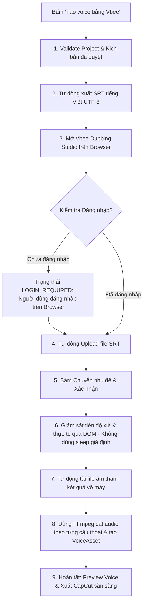

# Hướng dẫn Tích hợp & Vận hành Vbee Voice Automation

Tài liệu hướng dẫn chi tiết về tính năng **Tự động hóa tạo Voice qua Vbee Dubbing Studio** trong **VK Dub Studio**.

---

## 1. Tổng quan Kiến trúc

VK Dub Studio tích hợp tự động với [Vbee Dubbing Studio](https://studio.vbee.vn/studio/dubbing) theo kiến trúc module hóa tách biệt hoàn toàn tại `src/vkdub/integrations/vbee/`:

```text
src/vkdub/integrations/vbee/
├── __init__.py           # Public exports
├── state.py              # State Machine (11 trạng thái) & Checklist
├── selectors.py          # Tập trung toàn bộ DOM selectors & timeouts
├── session.py            # Quản lý Persistent Browser Context & Profile
├── automation.py         # Playwright automation engine (Upload, Submit, Wait, Download)
├── importer.py           # Chuẩn hóa âm thanh, cắt timeline & tạo VoiceAsset
├── provider.py           # Interface VoiceProvider & VbeeBrowserProvider
├── workflow.py           # State Machine Coordinator
└── errors.py             # Typed exceptions
```

### Ưu điểm kiến trúc:
- **Zero Coupling**: Không can thiệp vào logic STT, Gemini dịch, Preview video, hay CapCut Export hiện có.
- **Tập trung Selectors**: Khi Vbee thay đổi DOM, chỉ cần cập nhật `selectors.py` mà không phải sửa engine automation.
- **Bảo mật**: Tuyệt đối không lưu mật khẩu hay token tài khoản của người dùng. Profile trình duyệt lưu độc lập ở thư mục hệ thống bên ngoài Git.

---

## 2. Nơi lưu Trình duyệt & Browser Profile

Để đảm bảo phiên đăng nhập (cookies, local storage, session) được giữ lại cho các lần sử dụng tiếp theo:

- **Thư mục lưu Profile**:
  ```text
  %LOCALAPPDATA%\VKDubStudio\browser_profiles\vbee
  ```
  *(Ví dụ trên Windows: `C:\Users\<Username>\AppData\Local\VKDubStudio\browser_profiles\vbee`)*
- Thư mục này nằm hoàn toàn bên ngoài workspace và repository, được bảo vệ trong `.gitignore`.
- **Trình duyệt sử dụng**: Hệ thống tự động ưu tiên **Microsoft Edge** hoặc **Google Chrome** đã cài sẵn trên Windows, không cần tải thêm Chromium nặng nề.

---

## 3. Cách Đăng nhập Lần đầu

1. Mở dự án trong VK Dub Studio, hoàn tất bóc băng, dịch tiếng Việt và bấm **"Duyệt kịch bản"**.
2. Tại bảng điều khiển bên trái (khung **GIỌNG ĐỌC**), bấm nút:
   ```text
   ⚡ Tạo voice bằng Vbee
   ```
3. Cửa sổ tiến trình `VbeeWorkflowDialog` sẽ xuất hiện, đồng thời cửa sổ trình duyệt Vbee mở ra.
4. **Nếu chưa đăng nhập**:
   - Quy trình chuyển sang trạng thái: `LOGIN_REQUIRED` (`Cần đăng nhập Vbee trên trình duyệt`).
   - Người dùng thực hiện đăng nhập tài khoản Vbee bình thường trên cửa sổ trình duyệt vừa mở (hỗ trợ cả đăng nhập bằng Google, Facebook hoặc Email/Password).
5. Sau khi đăng nhập thành công:
   - Hệ thống tự động phát hiện phiên đăng nhập và tự động tiếp tục các bước tiếp theo (upload SRT, chuyển phụ đề, v.v.).
   - Cookie và session được tự động lưu vào persistent profile. Từ lần thứ 2 trở đi, bạn **không cần đăng nhập lại**.

---

## 4. Quy trình Chi tiết (Workflow Steps)



---

## 5. Xử lý Lỗi Thường Gặp (Troubleshooting)

| Tình huống / Lỗi | Nguyên nhân | Cách khắc phục |
| :--- | :--- | :--- |
| `Kịch bản chưa được duyệt` | Bạn chưa bấm xác nhận duyệt kịch bản | Tích chọn xác nhận và bấm nút **"Duyệt kịch bản"** tại bảng Kịch bản. |
| `Không thể kết nối tới Vbee` | Mất mạng hoặc Vbee bảo trì | Kiểm tra kết nối Internet và thử truy cập `studio.vbee.vn` trên trình duyệt. |
| `Vượt hạn mức / hết ký tự / credit` | Tài khoản Vbee hết số dư ký tự | Nâng cấp gói cước hoặc nạp thêm credit trên Vbee, sau đó bấm chạy lại. |
| `Hết thời gian chờ xử lý (Timeout)` | File SRT quá dài hoặc server Vbee quá tải | Tăng `DEFAULT_PROCESSING_TIMEOUT_S` trong `selectors.py` nếu video dài hơn 1 giờ. |
| `Không tìm thấy nút Tải xuống` | Giao diện Vbee có thể vừa cập nhật | Kiểm tra lại selectors theo hướng dẫn mục 6 bên dưới. |

---

## 6. Hướng dẫn Sửa Selectors khi Vbee Đổi Giao diện

Toàn bộ selectors được định nghĩa tập trung tại:
```text
src/vkdub/integrations/vbee/selectors.py
```

Nếu Vbee thay đổi HTML DOM hoặc đổi tên các nút bấm:
1. Mở trang [studio.vbee.vn/studio/dubbing](https://studio.vbee.vn/studio/dubbing) trên Chrome/Edge.
2. Bấm `F12` (Developer Tools) và dùng công cụ Inspect để tìm phần tử tương ứng.
3. Cập nhật selector mới vào `src/vkdub/integrations/vbee/selectors.py`:
   - **Nút Upload**: Cập nhật `FILE_INPUT_SELECTORS` hoặc `UPLOAD_BUTTON_SELECTORS`.
   - **Nút Chuyển phụ đề**: Cập nhật danh sách `SUBMIT_CONVERT_BUTTONS`.
   - **Dấu hiệu Hoàn thành**: Cập nhật `COMPLETION_INDICATORS`.
   - **Nút Tải xuống**: Cập nhật `DOWNLOAD_BUTTON_SELECTORS`.
   - **Thông báo lỗi/Hết quota**: Cập nhật `QUOTA_ERROR_SELECTORS`.
4. Chạy lại test bằng lệnh:
   ```bash
   pytest tests/test_vbee_*.py
   ```
